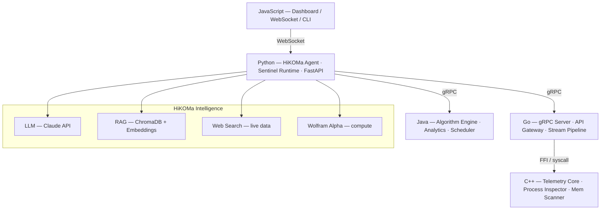

# Azimuth-Infra


**Azimuth-infra** — an open infrastructure platform and intelligent agent system

[](LICENSE)
[](https://python.org)
[](https://github.com/Donkru/Azimuth-infra/stargazers)
[](https://github.com/Donkru/Azimuth-infra/issues)
[](CONTRIBUTING.md)
[](https://github.com/Donkru/Azimuth-infra/wiki)

</div>

---

## What is Azimuth?

Azimuth is a self-hosted infrastructure platform and intelligent agent system built for developers who want full control over their servers, services, and AI assistants.

It is structured as three layers:

| Layer | Name | Role |
|---|---|---|
| Infrastructure | **Azimuth** | Docker, Traefik, Cloudflare, networking, deployment |
| Intelligence | **Sentinel** | System telemetry, observability, decision engine |
| Agent | **HiKOMa** | AI-powered operator: code assistant, admin, explainer |

HiKOMa is not a chatbot. It is a technical agent that reads your system telemetry, understands your codebase, and helps you manage, debug, and develop your infrastructure — all running locally on your own hardware.

---

## Architecture



---

## Features

- **System telemetry** — CPU, RAM, disk, network, process inspection via a native C++ collector
- **Intelligent interpretation** — Sentinel analyzes snapshots and generates human-readable diagnostics
- **Multi-source agent** — HiKOMa combines LLM reasoning, RAG over your codebase, live web search, and Wolfram Alpha for computation
- **Self-hosted** — everything runs on your own machine, no external dependencies required beyond the APIs you choose
- **Modular language stack** — each layer uses the right language for the job: C++, Go, Java, Python, JavaScript
- **Traefik + Docker** — all services managed through a structured Docker Compose stack with Traefik as the reverse proxy
- **DokuWiki knowledge base** — internal documentation and incident history stored in a self-hosted wiki

---

## Quick Start

### Prerequisites

- Linux (Ubuntu 22.04+ or Debian 12+)
- Docker + Docker Compose v2
- Python 3.12+
- Git

### 1. Clone the repository

```bash
git clone https://github.com/Donkru/Azimuth-infra.git
cd Azimuth-infra
```

### 2. Set up Python environment

```bash
python3 -m venv .venv
source .venv/bin/activate
pip install -r agent/sentinel/requirements.txt
```

### 3. Configure environment

```bash
cp .env.example .env
# Edit .env with your API keys and config — never commit this file
```

### 4. Start infrastructure services

```bash
cd infra/traefik
docker compose up -d
```

### 5. Run Sentinel

```bash
python3 -m agent.sentinel.app
```

### 6. Query HiKOMa

```bash
python3 test_runtime.py
```

---

## Project Structure

```
Azimuth-infra/
├── agent/
│   ├── sentinel/          # Core intelligence agent
│   │   ├── cognition/     # Decision engine, planner, interpreter
│   │   ├── interface/     # API (FastAPI), CLI, presenter
│   │   ├── llm/           # LLM client, prompt builder
│   │   ├── memory/        # History, recall, state store
│   │   ├── runtime/       # Orchestrator, session, runtime
│   │   ├── security/      # Authorization, command guard
│   │   └── tools/         # Tool registry, executor, system tools
│   └── hikoma/            # HiKOMa persona and interaction layer
│       ├── identity/      # Persona, voice
│       ├── interaction/   # Dialogue, presentation
│       └── relationship/  # Owner model, preferences
├── telemetry/             # System telemetry modules
│   ├── cpu.py             # CPU metrics
│   ├── memory.py          # RAM metrics
│   ├── process_monitor.py # Process inspection
│   ├── interpreter.py     # Narrative generation
│   ├── engine.py          # Analysis engine
│   └── snapshot.py        # System snapshot
├── infra/
│   └── traefik/           # Traefik reverse proxy config
├── memory/                # Shared state store
├── owner/                 # Owner profile
├── docs/                  # Architecture, roadmap, runtime flow
└── core/                  # Core shared utilities
```

---

## Stack

| Layer | Language | Libraries |
|---|---|---|
| Agent / Intelligence | Python 3.12 | FastAPI, SQLAlchemy, psutil, anthropic |
| Network / gRPC | Go | gRPC, protobuf |
| Algorithm Engine | Java | gRPC stub, JVM analytics |
| Telemetry Core | C++ | ptrace, /proc, libsystemd |
| Dashboard / CLI | JavaScript | WebSocket, React |
| Reverse Proxy | — | Traefik v2 |
| Orchestration | — | Docker Compose |
| Knowledge Base | — | DokuWiki |

---

## Documentation

Full documentation lives in the [GitHub Wiki](https://github.com/Donkru/Azimuth-infra/wiki):

- [Architecture overview](https://github.com/Donkru/Azimuth-infra/wiki/Architecture)
- [Getting started](https://github.com/Donkru/Azimuth-infra/wiki/Getting-Started)
- [Telemetry system](https://github.com/Donkru/Azimuth-infra/wiki/Telemetry)
- [HiKOMa agent](https://github.com/Donkru/Azimuth-infra/wiki/HiKOMa)
- [Contributing guide](https://github.com/Donkru/Azimuth-infra/wiki/Contributing)
- [Roadmap](https://github.com/Donkru/Azimuth-infra/wiki/Roadmap)

---

## Contributing

Azimuth is open to contributors. You can:

- Report bugs via [GitHub Issues](https://github.com/Donkru/Azimuth-infra/issues)
- Suggest features via the [Feature Request template](https://github.com/Donkru/Azimuth-infra/issues/new?template=feature_request.md)
- Submit a pull request — all skill levels welcome

Read [CONTRIBUTING.md](CONTRIBUTING.md) before submitting.

---

## Roadmap

- [ ] Go gRPC server layer
- [ ] C++ native telemetry collector (replace psutil)
- [ ] RAG pipeline over codebase and DokuWiki
- [ ] HiKOMa web dashboard (React + WebSocket)
- [ ] Java algorithm / decision engine
- [ ] Cloud extension layer (Azure / Oracle Cloud)
- [ ] HiKOMa voice and persona refinement
- [ ] Multi-user support and role-based access

---

## License

MIT — see [LICENSE](LICENSE) for details.

---

<div align="center">
Built by <a href="https://github.com/Donkru">Donkru</a> · Contributions welcome
</div>
